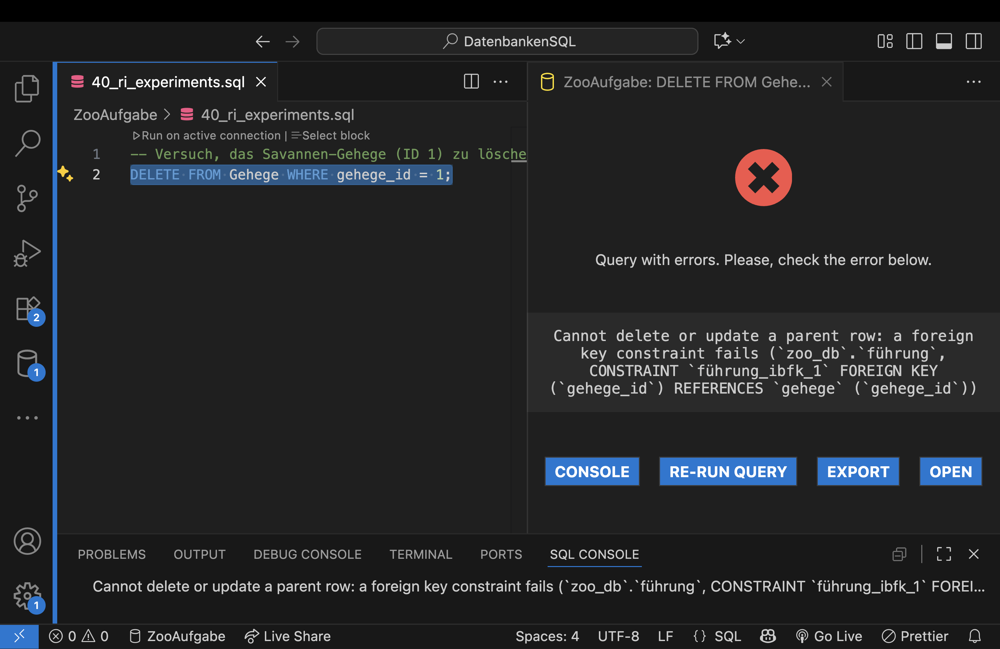
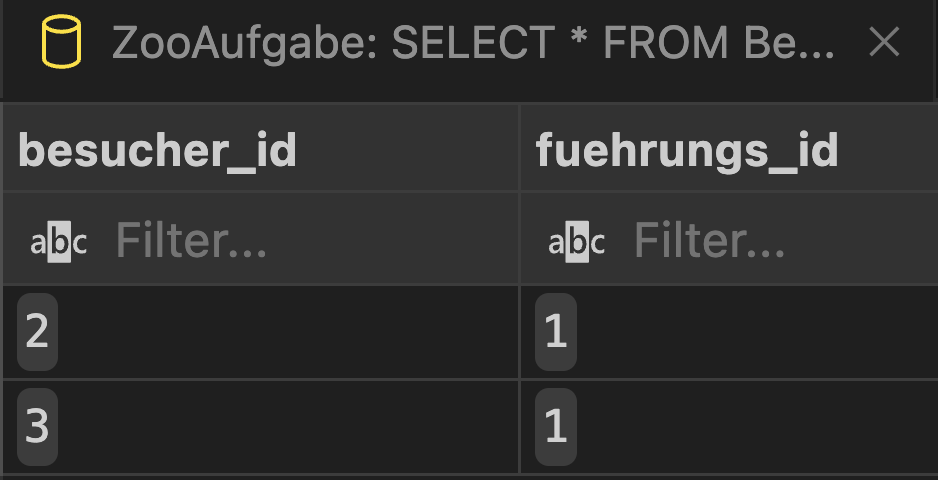
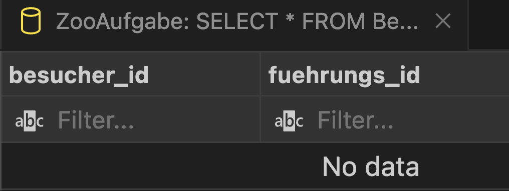
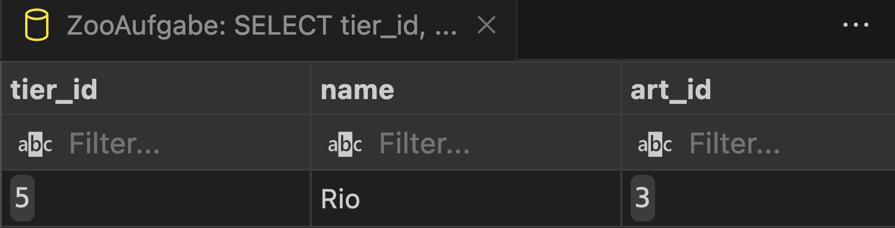
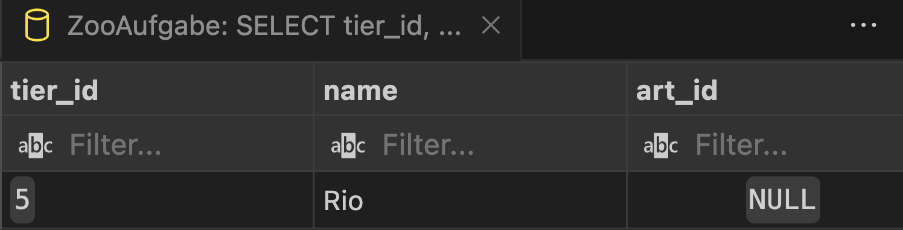

# Labor-Notizen: Experimente zur Referenziellen Integrität

Ergebnisse der drei Mikro-Experimente (Hypothese-Experiment-Beobachtung), um das Verhalten von Fremdschlüsseln in MySQL zu testen.

---

### C-Exp1: Standardverhalten (RESTRICT)

**Prediction (Hypothese):**
Wir gehen davon aus, dass MySQL den Löschvorgang eines Datensatzes in einer Elterntabelle (z.B. `Gehege`) verweigert, wenn noch mindestens ein Datensatz in einer Kindtabelle (z.B. `Tier`) über einen Fremdschlüssel darauf verweist. Wir erwarten eine Foreign-Key-Constraint-Fehlermeldung.

**Experiment SQL (Snippet):**
```sql
-- Wir versuchen, das Gehege mit der ID 1 ('Savanne') zu löschen,
-- obwohl dort noch Tiere (Simba, Nala) leben.
DELETE FROM Gehege WHERE gehege_id = 1;
```

**Observed outcome:**
Der Befehl wurde nicht ausgeführt. MySQL hat den Löschvorgang blockiert und die folgende Fehlermeldung zurückgegeben:
```code 
Cannot delete or update a parent row: a foreign key constraint fails (`zoo_db`.`führung`, CONSTRAINT `führung_ibfk_1` FOREIGN KEY (`gehege_id`) REFERENCES `gehege` (`gehege_id`)) 
```
Dies bestätigt unsere Hypothese.

**Decision & rationale (Entscheidung & Begründung):**
Das Standardverhalten `RESTRICT` ist für die Beziehung zwischen `Gehege` und `Tier` absolut sinnvoll. Es verhindert, dass Tiere versehentlich "obdachlos" werden, und sichert so die logische Konsistenz der Daten. Wir behalten dieses Verhalten bei.

Screenshot(s):


---

### C-Exp2: ON DELETE CASCADE

**Prediction (Hypothese):**
Nachdem wir den Fremdschlüssel in der Verbindungstabelle `Besucher_Fuehrung` auf `ON DELETE CASCADE` umgestellt haben, erwarten wir, dass beim Löschen einer Führung automatisch alle zugehörigen Einträge  in `Besucher_Fuehrung` mitgelöscht werden. Die Datenbank sollte "sauber" bleiben.

**Experiment SQL (Snippet):**
```sql
-- 1. Fremdschlüssel mit ON DELETE CASCADE neu definieren (Setup)
ALTER TABLE Besucher_Fuehrung DROP FOREIGN KEY besucher_fuehrung_ibfk_2;
ALTER TABLE Besucher_Fuehrung ADD CONSTRAINT fk_fuehrung_cascade
FOREIGN KEY (fuehrungs_id) REFERENCES Führung(fuehrungs_id) ON DELETE CASCADE;

-- 2. Zustand VOR dem Löschen prüfen
SELECT * FROM Besucher_Fuehrung WHERE fuehrungs_id = 1;

-- 3. Die Führung mit der ID 1 ('Pinguin-Fütterung') löschen
DELETE FROM Führung WHERE fuehrungs_id = 1;

-- 4. Zustand NACH dem Löschen prüfen
SELECT * FROM Besucher_Fuehrung WHERE fuehrungs_id = 1;
```

**Observed outcome (Beobachtung):**
Vor dem Löschen zeigte die `SELECT`-Abfrage zwei Einträge für `fuehrungs_id = 1`. Der `DELETE`-Befehl für die Führung wurde erfolgreich und ohne Fehler ausgeführt. Die anschließende `SELECT`-Abfrage auf `Besucher_Fuehrung` lieferte keine Ergebnisse mehr für `fuehrungs_id = 1`. Die abhängigen Zeilen wurden wie erwartet automatisch entfernt.

**Decision & rationale (Entscheidung & Begründung):**
`ON DELETE CASCADE` ist die perfekte Regel für Verbindungstabellen wie diese. Die Existenz einer Teilnahme (Besucher_Fuehrung) ist direkt von der Existenz der Veranstaltung (Führung) abhängig. Wird die Veranstaltung gelöscht, sind die Teilnahmedaten nicht mehr relevant.

**Screenshot(s):**

Ergebnis vor dem Löschen:

Ergebnisnach dem Löschen:


---

### C-Exp3: ON DELETE SET NULL

**Prediction (Hypothese):**
Wenn wir den Fremdschlüssel `art_id` in der Tier-Tabelle auf `ON DELETE SET NULL` umstellen (und die Spalte NULL-Werte erlauben), sollte das Löschen einer Tierart nicht das Tier selbst löschen. Stattdessen sollte nur das Feld `art_id` bei den betroffenen Tieren auf `NULL` gesetzt werden.

**Experiment SQL (Snippet):**
```sql
-- 1. Fremdschlüssel mit ON DELETE SET NULL neu definieren und Spalte auf NULLable ändern
ALTER TABLE Tier DROP FOREIGN KEY tier_ibfk_1;
ALTER TABLE Tier MODIFY art_id INT NULL;
ALTER TABLE Tier ADD CONSTRAINT fk_art_set_null
FOREIGN KEY (art_id) REFERENCES Tierart(art_id) ON DELETE SET NULL;

-- 2. Zustand VOR dem Löschen prüfen
SELECT tier_id, name, art_id FROM Tier WHERE name = 'Rio';

-- 3. Die Tierart 'Papagei' (ID 3) löschen
DELETE FROM Tierart WHERE art_id = 3;

-- 4. Zustand NACH dem Löschen prüfen
SELECT tier_id, name, art_id FROM Tier WHERE name = 'Rio';
```

**Observed outcome (Beobachtung):**
Vor dem Löschen hatte das Tier 'Rio' die `art_id 3`. Nach dem Löschen der Tierart 'Papagei' existierte der Datensatz für 'Rio' weiterhin, aber sein `art_id`-Feld hatte nun den Wert `NULL`. Die Aktualisierung erfolgte automatisch und fehlerfrei.

**Decision & rationale (Entscheidung & Begründung):**
`ON DELETE SET NULL` ist eine gute Wahl, wenn die Beziehung optional ist. Ein Tier hört nicht auf zu existieren, nur weil seine Art aus dem System gelöscht wird. Es verliert lediglich diese spezifische Information. Dies verhindert unerwünschten Datenverlust und kennzeichnet Datensätze, die eventuell manuell überprüft oder aktualisiert werden müssen.

**Screenshot(s):**

Vor dem Löschen:

Nach dem Löschen:
