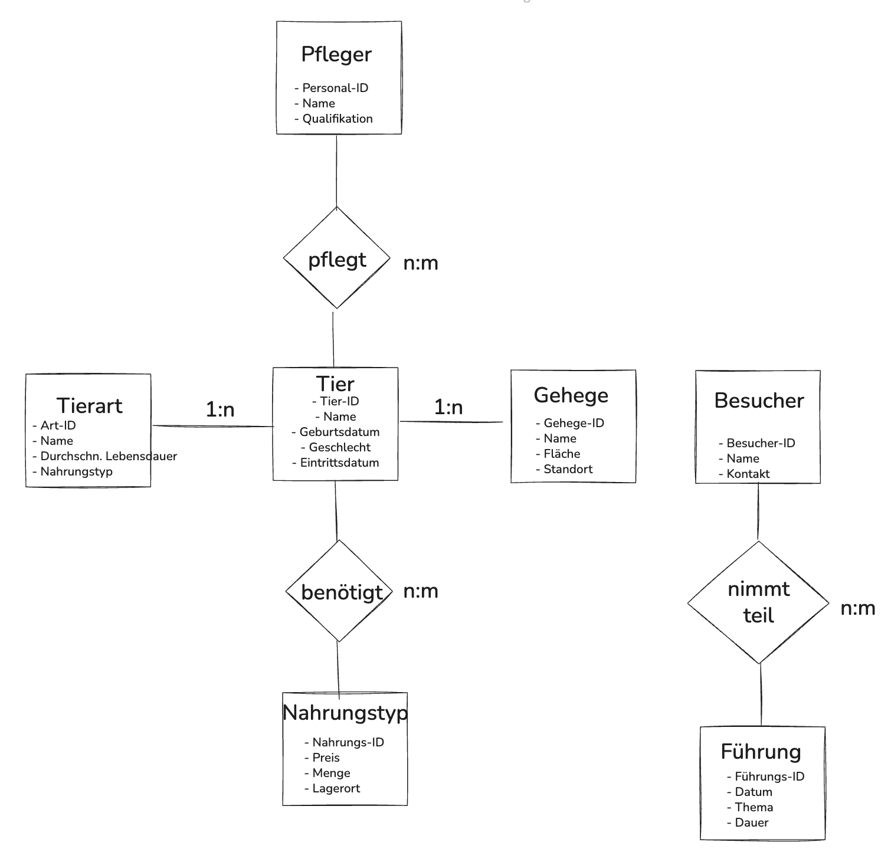
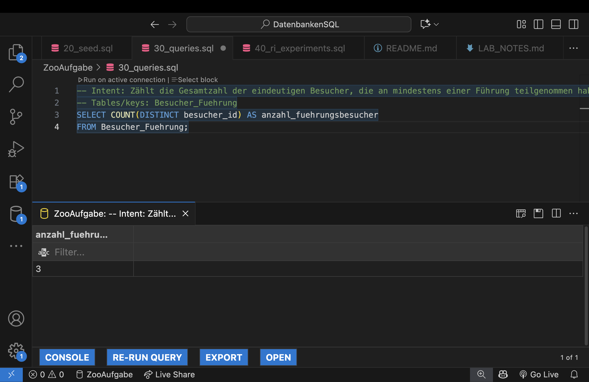
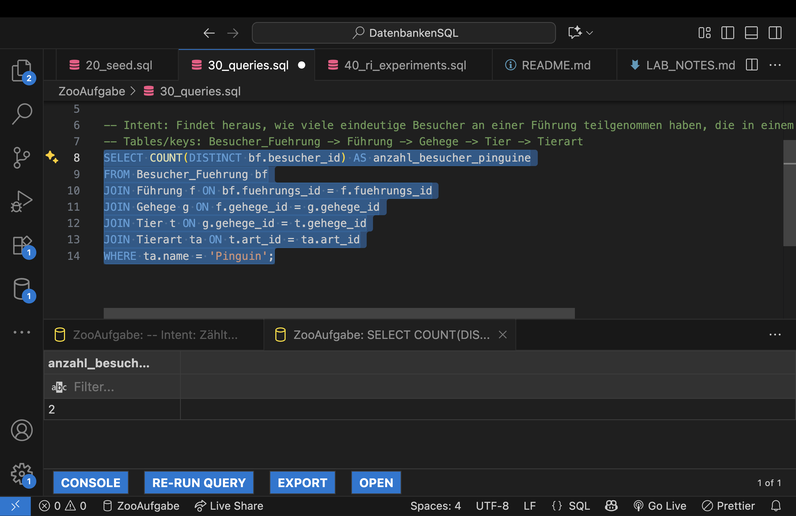
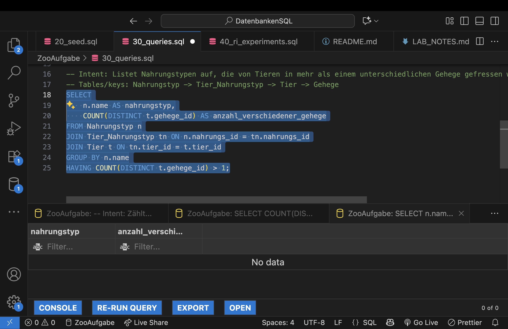

# Zoo-Aufgabe

Anlegen einer Datenbank mit mehreren Tabellen mit dem Thema `Zoo`.
Lernen von grundlegenden SQL Befehlen, Syntax und Arbeiten mit Tabellen in einer Datenbank.
[LAB NOTES](LAB_NOTES.md)

---

### ER-Diagramm

---

### Stakeholder-Fragen
- Wie viele Besucher haben an einer Führung teilgenommen?
- Wie viele Führungsbesucher haben die Tierart `Pinguine` gesehen?
- Gibt es Tierarten, die denselben Nahrungstyp teilen, aber in unterschiedlichen Gehegen leben?

---

### Beantwortung der Fragen mit SQL
**Frage 1:**

**Frage 2:**

**Frage 3:**

---

### Info
Da wir mit MySQL gearbeitet haben, brauchen wir kein `PRAGMA`-Befehl wie in SQLite nötig wäre, weil die Foreign-Key-Prüfung in MySQL standardmäßig aktiv ist.